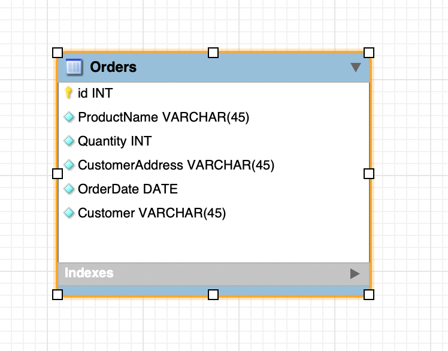
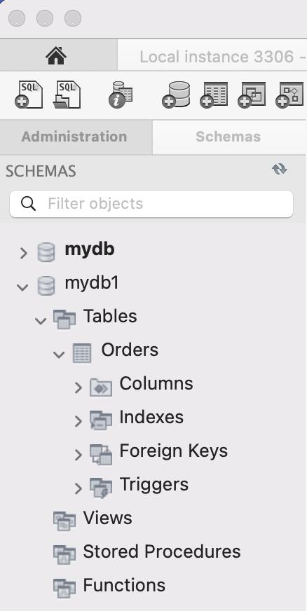
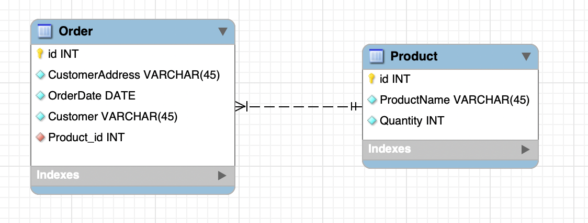
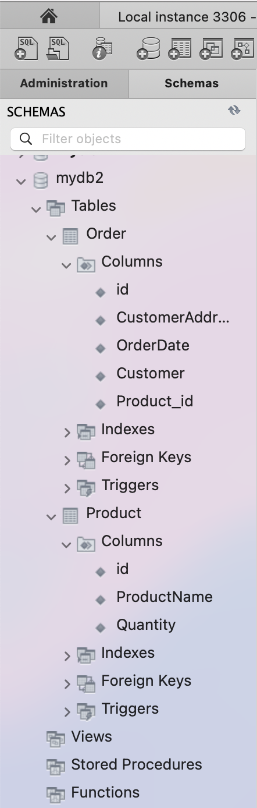
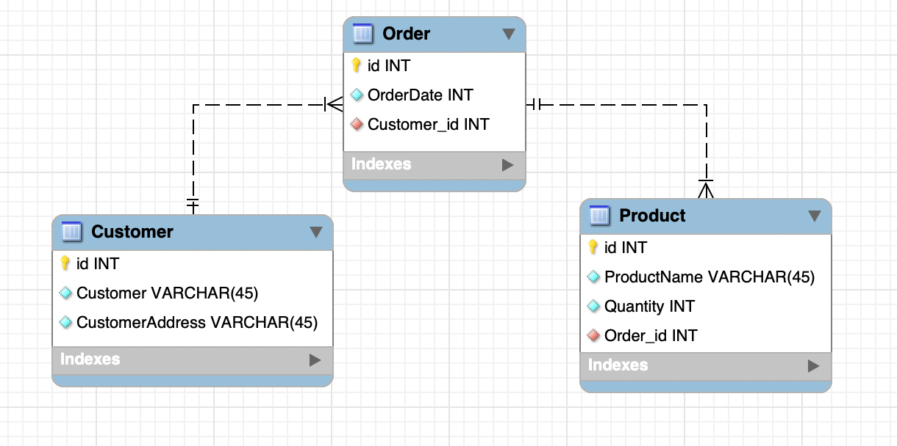
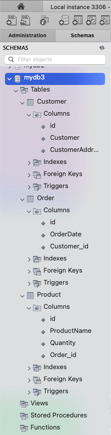

# goit-rdb-hw-02

# Опис завдання

- `Завдання 1` Переведіть початкову таблицю в першу нормальну форму.

- `Завдання 2` Переведіть нові таблиці в другу нормальну форму.

- `Завдання 3` Переведіть нові таблиці в третю нормальну форму.

- `Завдання 4` Розробіть ER-діаграму отриманих таблиць.

## Початкова таблиця

| Номер_замовлення | Назва_товару і кількість | Адреса_клієнта | Дата_замовлення | Клієнт    |
| ---------------- | ------------------------ | -------------- | --------------- | --------- |
| 101              | Лептоп: 3, Мишка: 2      | Хрещатик 1     | 2023-03-15      | Мельник   |
| 102              | Принтер: 1               | Басейна 2      | 2023-03-16      | Шевченко  |
| 103              | Мишка: 4                 | Комп'ютерна 3  | 2023-03-17      | Коваленко |

## Завдання 1

Переведіть початкову таблицю в першу нормальну форму.

## Розвязання завдання 1

| Номер_замовлення | Назва_товару | Кількість_товару | Адреса_клієнта | Дата_замовлення | Клієнт    |
| ---------------- | ------------ | ---------------- | -------------- | --------------- | --------- |
| 101              | Лептоп       | 3                | Хрещатик 1     | 2023-03-15      | Мельник   |
| 101              | Мишка        | 2                | Хрещатик 1     | 2023-03-15      | Мельник   |
| 102              | Принтер      | 1                | Басейна 2      | 2023-03-16      | Шевченко  |
| 103              | Мишка        | 4                | Комп'ютерна 3  | 2023-03-17      | Коваленко |

## Завдання 4 ER-Діаграма

Розгорнута схема у Workbench

.

## Завдання 2

Переведіть нові таблиці в другу нормальну форму.

## Розвязання завдання 2

### Таблиця `Замовлення`

| Номер_замовлення | Адреса_клієнта | Дата_замовлення | Клієнт    |
| ---------------- | -------------- | --------------- | --------- |
| 101              | Хрещатик 1     | 2023-03-15      | Мельник   |
| 102              | Басейна 2      | 2023-03-16      | Шевченко  |
| 103              | Комп'ютерна 3  | 2023-03-17      | Коваленко |

### Таблиця `Товари`

| Номер_замовлення | Назва_товару | Кількість_товару |
| ---------------- | ------------ | ---------------- |
| 101              | Лептоп       | 3                |
| 101              | Мишка        | 2                |
| 102              | Принтер      | 1                |
| 103              | Мишка        | 4                |

## Завдання 4 ER-Діаграма

Розгорнута схема у Workbench

.

## Завдання 3

Переведіть нові таблиці в третю нормальну форму.

## Розвязання завдання 3

### Таблиця `Замовлення`

| Номер_замовлення | Дата_замовлення | Клієнт_ID |
| ---------------- | --------------- | --------- |
| 101              | 2023-03-15      | 1         |
| 102              | 2023-03-16      | 2         |
| 103              | 2023-03-17      | 3         |

### Таблиця `Клієнти`

| Клієнт_ID | Клієнт    | Адреса_клієнта |
| --------- | --------- | -------------- |
| 1         | Мельник   | Хрещатик 1     |
| 2         | Шевченко  | Басейна 2      |
| 3         | Коваленко | Комп'ютерна 3  |

### Таблиця `Товари`

| Номер_замовлення | Назва_товару | Кількість_товару |
| ---------------- | ------------ | ---------------- |
| 101              | Лептоп       | 3                |
| 101              | Мишка        | 2                |
| 102              | Принтер      | 1                |
| 103              | Мишка        | 4                |

## Завдання 4 ER-Діаграма

Розгорнута схема у Workbench

.
